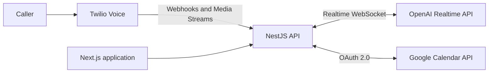

# Ansolari - AI Voice Agent for Automotive Businesses

Ansolari is an AI voice agent designed to help automotive businesses handle incoming calls and automate appointment scheduling.

The project focuses on a concrete operational problem: garages often miss calls while technicians are working, which can lead to lost appointments and repetitive administrative work.

> **Status:** Active development. The main source repository is private; this repository provides selected anonymized, executable source excerpts, architecture notes and explicit limitations. The complete application remains private.

## What is implemented

- Twilio Voice webhook handling for inbound calls
- Real-time inbound audio reception through Twilio Media Streams
- WebSocket connection to the OpenAI Realtime API
- Google Calendar integration using OAuth 2.0
- Real availability checks with the Google Calendar FreeBusy API
- Appointment creation with Google Calendar Events
- Slot revalidation immediately before booking
- Conflict revalidation and sequential duplicate rejection (concurrent booking remains a known limitation)
- Protected test endpoints and environment-based secret management
- Executable Jest tests for extracted calendar behaviour and synthetic Media Streams events

## Architecture



The application is organised as a TypeScript monorepo:

```text
apps/
  web/    Next.js application
  api/    NestJS API and external integrations
```

## Appointment workflow

1. An incoming call reaches the Twilio phone number.
2. Twilio invokes the NestJS voice webhook and starts a Media Stream.
3. The API receives the caller's mu-law 8 kHz audio in real time.
4. The conversational layer connects to the OpenAI Realtime API.
5. The scheduling service queries Google Calendar for available slots.
6. The selected slot is checked again immediately before confirmation.
7. If the slot is still available, the appointment is created in Google Calendar.
8. If it has become unavailable, the API returns a controlled conflict response instead of creating a duplicate booking.

## Historical integration observations (author-reported)

The following observations were already recorded in this repository. They were not rerun during extraction; the public tests use mocks and do not independently verify these live results.

### Twilio Voice

A real inbound call successfully produced the expected Media Streams lifecycle:

```text
connected -> start -> media -> stop
```

The test call delivered 443 inbound audio chunks, representing 70,880 bytes of mu-law 8 kHz audio.

### Google Calendar

The real OAuth and Calendar workflow has been validated end to end:

- OAuth offline access and refresh-token handling
- FreeBusy availability query
- generation of three available appointment slots
- real event creation
- removal of the newly booked slot from subsequent availability results
- final revalidation to detect conflicts before insertion; this is not an atomic reservation

## Reliability and security

- OAuth state validation protects the Google authorization flow.
- Calendar scopes are limited to events and availability.
- Secrets and tokens are loaded from environment variables and excluded from version control.
- Test routes are protected by a dedicated access token.
- External calendar access is isolated behind a provider interface, allowing fake and Google implementations.
- Availability is revalidated before every booking instead of trusting a previously proposed slot.
- External-service errors are converted into controlled application responses.

## Run the public examples

Requires Node.js >=22.13 and pnpm 11.20.0 (`packageManager` is pinned).

```sh
corepack enable
pnpm install --frozen-lockfile
pnpm typecheck
pnpm test
pnpm demo
```

No credentials or external services are required after installation. All demo data and audio are synthetic. [`.env.example`](.env.example) contains variable names only.

- [Provider contract](examples/calendar/calendar.service.ts) and [provider selection](examples/calendar/calendar-provider.interface.ts)
- [Real extracted availability and booking logic](examples/calendar/google-calendar.service.ts)
- [Adapted original Jest tests](examples/calendar/google-calendar.service.spec.ts) and [conflict/race tests](examples/calendar/conflict.spec.ts)
- [Media Streams event handling](examples/voice/media-stream-events.example.ts)
- [Extraction provenance and limitations](docs/PROVENANCE.md)
- [Technical demo walkthrough](docs/DEMO.md)

The concurrency characterization test passes by demonstrating that two simultaneous Google bookings can both insert an event. A passing suite does **not** imply production-grade double-booking prevention.

## Technology stack

| Area | Technologies |
| --- | --- |
| Frontend | Next.js, React, TypeScript |
| Backend | NestJS, Node.js, TypeScript |
| Voice | Twilio Voice, Twilio Media Streams |
| AI | OpenAI Realtime API |
| Scheduling | Google Calendar API, OAuth 2.0 |
| Tooling | pnpm workspaces, Jest, ESLint, Cloudflare Tunnel |

## Current limitations

- The complete spoken conversation-to-booking flow is still being finalised and has not yet been validated as a single uninterrupted production workflow.
- The product has not yet been deployed to paying customers.
- Operational monitoring, call summaries, and customer-facing administration remain part of the next implementation stages.

These limitations are documented deliberately to distinguish validated components from planned functionality.

## Roadmap

- Complete the full voice-to-booking round trip
- Add structured call summaries
- Improve conversational interruption and call-ending behaviour
- Add observability for latency, errors, token usage, and external APIs
- Run a controlled pilot with an automotive business

## Demo

Run `pnpm demo` for a local, synthetic demonstration of availability, booking, conflict rejection and inbound audio forwarding. See the [walkthrough](docs/DEMO.md) and [verification record](docs/VERIFICATION.md).

## Author

**Juan-Pablo Londono Ramirez**

- [Portfolio](https://juan-pablo-lr-portfolio.vercel.app/)
- [LinkedIn](https://www.linkedin.com/in/juannpl/)
- [GitHub](https://github.com/Juannpl)

